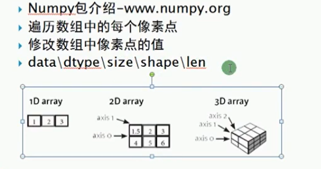

### openCV模块

[TOC]


```powershell
pip install opencv-python
pip install opencv-contrib-python #安装扩展模块
pip install pytesseract
```

#### pycharm中opencv-python 不自动提示的解决方案

在安装目录下找到cv2.cp37-win_amd64.pyd 文件，我们需要将这个文件修改名字为 cv2.pyd之后拷贝到site-packages路径下，为了防止错误，我们也可以将 cv2.cp37-win_amd64.pyd 复制一份到site-pachages路径下然后改名，这样再重新打开pycharm软件，就会发现有提示了，并且函数的使用方法也会有提示。

#### 测试环境是否安装成功

``` python
import cv2 as cv

if __name__ == '__main__':
    src = cv.imread('image/test.jpg')
    cv.namedWindow('input image', cv.WINDOW_AUTOSIZE)
    cv.imshow('input image', src)  # 第一个参数窗口名字，图像
    cv.waitKey(0)  # 对应空格键
    cv.destroyAllWindows()
    print('Hi, Python!')
```

### 图像的加载与保存


``` python
import cv2 as cv


def video_demo():
    capture = cv.VideoCapture(0)
    while True:
        ret, frame = capture.read()
        cv.flip(frame, 1)
        cv.imshow("Video", frame)
        c = cv.waitKey(50)  # 等待用于显示
        if c == 27:  # 对应esc键
            break


def get_image_info(image):
    print(type(image))
    print(image.shape)  # 高宽通道
    print(image.size)  # 总的数据个数
    print(image.dtype)  # 数据类型


if __name__ == '__main__':
    src = cv.imread('image/test.jpg')
    cv.namedWindow('input image', cv.WINDOW_AUTOSIZE)
    cv.imshow('input image', src)  # 第一个参数窗口名字，图像
    cv.namedWindow('Video', cv.WINDOW_AUTOSIZE)
    video_demo()
    get_image_info(src)

    gray = cv.cvtColor(src, cv.COLOR_BGR2GRAY)
    cv.imwrite('image/result.png', gray)
    cv.waitKey(0)  # 对应空格键
    cv.destroyAllWindows()
```

### Numpy数组



```python
import cv2 as cv
import numpy as np


def access_pixels(image):
    print(image.shape)
    height = image.shape[0]
    width = image.shape[1]
    channels = image.shape[2]
    print('width:{}, height:{}, channels:{}'.format(width, height, channels))
    for row in range(height):
        for col in range(width):
            for c in range(channels):
                pv = image[row, col, c]
                image[row, col, c] = 255 - pv
    cv.imshow("pixels_demo", image)


def invert(image):
    dst = cv.bitwise_not(image)  # 像素取反 255 - image
    cv.imshow("invert", dst)


def create_image():
    img = np.zeros([400, 400, 3], np.uint8)
    img[:, :, 2] = np.ones([400, 400]) * 255
    cv.imshow("New_image", img)
    gray = np.ones([400, 400], np.uint8)*127  # 要声明类型
    cv.imshow("New_gray", gray)


if __name__ == '__main__':
    src = cv.imread('image/test.jpg')  # BGR
    cv.namedWindow('input image', cv.WINDOW_AUTOSIZE)
    cv.imshow('input image', src)  # 第一个参数窗口名字，图像
    t1 = cv.getTickCount()
    # access_pixels(src)
    # create_image()
    invert(src)
    t2 = cv.getTickCount()
    print("time:{}ms".format((t2 - t1)/cv.getTickFrequency()*1000))
    cv.waitKey(0)  # 对应空格键
    cv.destroyAllWindows()
```

### 色彩空间


```python
import cv2 as cv
import numpy as np


def color_space_demo(image):
    gray = cv.cvtColor(image, cv.COLOR_BGR2GRAY)
    cv.imshow("Gray", gray)
    hsv = cv.cvtColor(image, cv.COLOR_BGR2HSV)
    cv.imshow('HSV', hsv)
    yuv = cv.cvtColor(image, cv.COLOR_BGR2YUV)
    cv.imshow("YUV", yuv)
    Ycrcb = cv.cvtColor(image, cv.COLOR_BGR2YCrCb)
    cv.imshow("YCRCB", Ycrcb)


def extrace_object_demo():
    capture = cv.VideoCapture(0)
    while True:
        ret, frame = capture.read()
        if not ret:
            break
        hsv = cv.cvtColor(frame, cv.COLOR_BGR2HSV)
        lower_hsv = np.array([35, 43, 46])
        upper_hsv = np.array([77, 255, 255])  # 对应上表中绿色的范围
        mask = cv.inRange(hsv, lowerb=lower_hsv, upperb=upper_hsv)  # 得到绿色区域的二值图像
        cv.imshow("mask", mask)
        cv.imshow("video", frame)
        c = cv.waitKey(50)
        if c == 27:
            break


def split_merge_channel(image):
    b, g, r = cv.split(image)
    cv.imshow("blue", b)
    cv.imshow("green", g)
    cv.imshow("red", r)

    merged = cv.merge([b, g, r])
    cv.imshow("merged image", merged)


if __name__ == '__main__':
    src = cv.imread('image/test.jpg')
    cv.namedWindow('input image', cv.WINDOW_AUTOSIZE)
    cv.imshow('input image', src)  # 第一个参数窗口名字，图像
    # color_space_demo(src)
    # extrace_object_demo()
    split_merge_channel(src)
    cv.waitKey(0)  # 对应空格键
    cv.destroyAllWindows()

```

### 像素运算

```python
import cv2 as cv
import numpy as np


def add_demo(m1, m2):
    dst = cv.add(m1, m2)
    cv.imshow("add demo", dst)


def subtract_demo(m1, m2):
    dst = cv.subtract(m1, m2)
    cv.imshow("subtract demo", dst)


def multiply_demo(m1, m2):
    dst = cv.multiply(m1, m2)
    cv.imshow("multiply demo", dst)


def divide_demo(m1, m2):
    dst = cv.divide(m1, m2)
    cv.imshow("divide demo", dst)


def mean_demo(m1, m2):
    M1 = cv.mean(m1)
    M2 = cv.mean(m2)
    print(M1)
    print(M2)
    M1, dev1 = cv.meanStdDev(m1)
    M2, dev2 = cv.meanStdDev(m2)
    print(M1)
    print(M2)
    print(dev1)
    print(dev2)


def logic_demo(m1, m2):
    dst = cv.bitwise_not(m2)  # 255 - m
    cv.imshow("bitwise_not demo", dst)

    dst = cv.bitwise_and(m1, m2)
    cv.imshow("bitwise_and demo", dst)

    dst = cv.bitwise_or(m1, m2)
    cv.imshow("bitwise_or demo", dst)

    dst = cv.bitwise_xor(m1, m2)
    cv.imshow("bitwise_xor demo", dst)


def contrast_brightness_demo(image, c, b):  # 对比度亮度
    h, w, ch = image.shape
    blank = np.zeros([h, w, ch], image.dtype)
    dst = cv.addWeighted(image, c, blank, 1-c, b)  # 利用两幅图像的加权和进行图像的对比度和亮度的处理
    cv.imshow("contrast_brightness_demo", dst)


if __name__ == '__main__':
    src1 = cv.imread('image/linux.jpg')
    src2 = cv.imread('image/windows.jpg')
    print(src1.shape)
    print(src2.shape)
    cv.imshow('linux', src1)  # 第一个参数窗口名字，图像
    cv.imshow('windows', src2)
    # add_demo(src1, src2)
    # subtract_demo(src1, src2)
    # divide_demo(src1, src2)
    # multiply_demo(src1, src2)
    # mean_demo(src1, src2)
    # logic_demo(src1, src2
    contrast_brightness_demo(src1, 5, 0)
    cv.waitKey(0)  # 随便按一个键

    cv.destroyAllWindows()

```

### ROI与图像的泛洪填充

泛洪填充示例：


```python
import cv2 as cv
import numpy as np


def ROI_demo(image):
    face = image[50:150, 200:300]
    gray = cv.cvtColor(face, cv.COLOR_BGR2GRAY)
    backface = cv.cvtColor(gray, cv.COLOR_GRAY2BGR)  # 将灰度图转换为三个通道
    image[50:150, 200:300] = backface
    cv.imshow("face", image)


def fill_color_demo(image):
    copyImg = image.copy()
    h, w = image.shape[:2]
    mask = np.zeros([h+2, w+2], np.uint8)
    cv.floodFill(copyImg, mask, (30, 30), (0, 255, 255), (100, 100, 100), (50, 50, 50), cv.FLOODFILL_FIXED_RANGE)
    cv.imshow("fill color demo", copyImg)


def fill_binary():
    image = np.zeros([400, 400, 3], np.uint8)
    image[100:300, 100:300, :] = 255
    cv.imshow("fill_binary", image)

    mask = np.ones([402, 402, 1], np.uint8)
    mask[101:301, 101:301] = 0
    cv.floodFill(image, mask, (200, 200), (100, 2, 255), cv.FLOODFILL_MASK_ONLY)
    cv.imshow("filled_binary", image)


if __name__ == '__main__':
    src = cv.imread('image/test.jpg')
    cv.namedWindow('input image', cv.WINDOW_AUTOSIZE)
    cv.imshow('input image', src)  # 第一个参数窗口名字，图像
    print(src.shape)
    ROI_demo(src.copy())
    fill_color_demo(src)
    fill_binary()
    cv.waitKey(0)  # 对应空格键
    cv.destroyAllWindows()

```

### 模糊操作

```python
import cv2 as cv
import numpy as np


def mean_blur_image(image):
    dst = cv.blur(image, (1, 15))
    cv.imshow("mean blur image", dst)


def median_blur_image(image):
    dst = cv.medianBlur(image, 5)
    cv.imshow("median blur image", dst)


def custom_blur_demo(image):
    kernel = np.ones([5, 5], np.float32) / 25
    kernel = np.array([[0, -1, 0], [-1, 5, -1], [0, -1, 0]], np.float32)
    dst = cv.filter2D(image, -1, kernel=kernel)
    cv.imshow("custom blur image", dst)


if __name__ == '__main__':
    src = cv.imread('image/test.jpg')
    cv.namedWindow('input image', cv.WINDOW_AUTOSIZE)
    cv.imshow('input image', src)  # 第一个参数窗口名字，图像
    mean_blur_image(src)
    median_blur_image(src)
    custom_blur_demo(src)
    cv.waitKey(0)  # 对应空格键
    cv.destroyAllWindows()

```

### 高斯模糊


```python
import cv2 as cv
import numpy as np


def clamp(pv):
    if pv > 255:
        return 255
    elif pv < 0:
        return 0
    else:
        return pv


def gausian_noise(image):
    h, w, c = image.shape
    for row in range(h):
        for col in range(w):
            s = np.random.normal(0, 20, c)
            for ch in range(c):
                image[row, col, ch] = clamp(image[row, col, ch] + s[ch])
            # b = image[row, col, 0]
            # g = image[row, col, 1]
            # r = image[row, col, 2]
            # image[row, col, 0] = clamp(b + s[0])
            # image[row, col, 1] = clamp(g + s[0])
            # image[row, col, 2] = clamp(r + s[2])
            cv.imshow("noise image", image)


if __name__ == '__main__':
    src = cv.imread('image/test.jpg')
    cv.namedWindow('input image', cv.WINDOW_AUTOSIZE)
    cv.imshow('input image', src)  # 第一个参数窗口名字，图像
    t1 = cv.getTickCount()
    gausian_noise(src)
    dst = cv.GaussianBlur(src, (0, 0), 15)
    cv.imshow('noise image', dst)
    t2 = cv.getTickCount()
    print("time:{}s".format((t2-t1)/cv.getTickFrequency()))
    cv.waitKey(0)  # 对应空格键
    cv.destroyAllWindows()
```

### 边缘保留滤波

#### 高斯双边模糊滤波器：


```python
import cv2 as cv
import numpy as np


def bi_demo(image):
    dst = cv.bilateralFilter(image, 0, 100, 15)
    cv.imshow("bi demo", dst)


def epf_demo(image):
    dst = cv.pyrMeanShiftFiltering(image, 10, 50)  # 均值迁移，有点油画效果
    cv.imshow("epf demo", dst)


if __name__ == '__main__':
    src = cv.imread('image/example.png')
    cv.namedWindow('input image', cv.WINDOW_AUTOSIZE)
    cv.imshow('input image', src)  # 第一个参数窗口名字，图像
    bi_demo(src)
    epf_demo(src)
    cv.waitKey(0)  # 对应空格键
    cv.destroyAllWindows()
    print('Hi, Python!')
```

### 图像直方图


```python
import cv2 as cv
from matplotlib import pyplot as plt


def plot_demo(image):
    plt.hist(image.ravel(), 256, [0, 256])  # ravel函数将多维数组变成1维的
    plt.title("hist")
    plt.show()


def image_hist(image):
    color = ('blue', 'green', 'red')
    for i, co in enumerate(color):
        hist = cv.calcHist([image], [i], None, [256], [0, 256])
        plt.plot(hist, color=co)
        plt.xlim([0, 256])
    plt.show()


if __name__ == '__main__':
    src = cv.imread('image/test.jpg')
    cv.namedWindow('input image', cv.WINDOW_AUTOSIZE)
    cv.imshow('input image', src)  # 第一个参数窗口名字，图像
    plot_demo(src)
    image_hist(src)
    cv.waitKey(0)  # 对应空格键
    cv.destroyAllWindows()

```

### 直方图应用


```python
import cv2 as cv
import numpy as np


def equalHist_demo(image):
    gray = []
    if len(image.shape) == 3:
        gray = cv.cvtColor(image, cv.COLOR_BGR2GRAY)
    else:
        gray = image
    dst = cv.equalizeHist(gray)
    cv.imshow("equalHist demo", dst)


def clahe_demo(image):
    gray = []
    if len(image.shape) == 3:
        gray = cv.cvtColor(image, cv.COLOR_BGR2GRAY)
    else:
        gray = image

    clahe = cv.createCLAHE(clipLimit=2.0, tileGridSize=(8, 8))
    dst = clahe.apply(gray)
    cv.imshow("clahe demo", dst)


def create_rgb_hist(image):
    h, w, c = image.shape
    rgbHist = np.zeros([16*16*16, 1], np.float32)
    bsize = 256/16
    for row in range(h):
        for col in range(w):
            b = image[row, col, 0]
            g = image[row, col, 1]
            r = image[row, col, 2]
            index = np.int(b/bsize)*16*16 + np.int(g/bsize)*16 + np.int(r/bsize)
            rgbHist[np.int(index), 0] += 1
    return rgbHist


def hist_compare(m1, m2):
    hist1 = create_rgb_hist(m1)
    hist2 = create_rgb_hist(m2)
    match1 = cv.compareHist(hist1, hist2, cv.HISTCMP_BHATTACHARYYA)
    match2 = cv.compareHist(hist1, hist2, cv.HISTCMP_CORREL)
    match3 = cv.compareHist(hist1, hist2, cv.HISTCMP_CHISQR)
    print("巴氏距离：{}， 相关性：{}， 卡方：{}".format(match1, match2, match3))


if __name__ == '__main__':
    src1 = cv.imread('image/lena.png')
    src2 = cv.imread("image/lenanoise.png")
    cv.namedWindow('input image', cv.WINDOW_AUTOSIZE)
    cv.imshow('input image', src1)  # 第一个参数窗口名字，图像
    # equalHist_demo(src)
    # clahe_demo(src)
    hist_compare(src1, src2)
    cv.waitKey(0)  # 对应空格键
    cv.destroyAllWindows()

```

### 直方图反向投影

```python
import cv2 as cv
import numpy as np
from matplotlib import pyplot as plt


def hist2d_demo(image):
    hsv = cv.cvtColor(image, cv.COLOR_BGR2HSV)
    hist = cv.calcHist([image], [0, 1], None, [180, 256], [0, 180, 0, 256])
    cv.imshow("hist2d", hist)
    plt.imshow(hist, interpolation="nearest")
    plt.title("2D Histogram")
    plt.show()


def back_projection_demo():
    sample = np.array([])
    target = np.array([])
    roi_hsv = cv.cvtColor(sample, cv.COLOR_BGR2HSV)
    target_hsv = cv.cvtColor(target, cv.COLOR_BGR2HSV)

    roiHist = cv.calcHist([roi_hsv], [0, 1], None, [180, 256], [0, 180, 0, 256])
    cv.normalize(roiHist, roiHist, 0, 255, cv.NORM_MINMAX)
    dst = cv.calcBackProject(target_hsv, [0, 1], roiHist, [0, 180, 0, 256], 1)
    cv.imshow("back_projection_demo", dst)


if __name__ == '__main__':
    src = cv.imread('image/test.jpg')
    cv.namedWindow('input image', cv.WINDOW_AUTOSIZE)
    cv.imshow('input image', src)  # 第一个参数窗口名字，图像
    hist2d_demo(src)
    cv.waitKey(0)  # 对应空格键
    cv.destroyAllWindows()
    print('Hi, Python!')
```

### 模板匹配

积分图，转频率域加快计算

```python
import cv2 as cv
import numpy as np


def template_demo():
    tpl = np.array([])
    target = np.array([])
    methods = [cv.TM_SQDIFF_NORMED, cv.TM_CCORR_NORMED, cv.TM_CCOEFF_NORMED]
    th, tw = tpl.shape[:2]
    for md in methods:
        result = cv.matchTemplate(target, tpl, md)
        min_val, max_val, min_loc, max_loc = cv.minMaxLoc(result)
        if md == cv.TM_SQDIFF_NORMED:
            tl = min_loc
        else:
            tl = max_loc
        br = (tl[0]+tw, tl[1]+th)
        cv.rectangle(target, tl, br, (0, 0, 255), 2)
        cv.imshow("template_demo"+np.str(md), target)
            
            
if __name__ == '__main__':
    src = cv.imread('image/test.jpg')
    cv.namedWindow('input image', cv.WINDOW_AUTOSIZE)
    cv.imshow('input image', src)  # 第一个参数窗口名字，图像

    cv.waitKey(0)  # 对应空格键
    cv.destroyAllWindows()

```

### 图像二值化

```python
import cv2 as cv
import numpy as np


def threshold_demo(image):
    gray = cv.cvtColor(image, cv.COLOR_BGR2GRAY)
    ret, binary = cv.threshold(gray, 127, 255, cv.THRESH_BINARY | cv.THRESH_TOZERO)
    print("thresh value:{}".format(ret))
    cv.imshow("thresh image", binary)


def local_threshold_demo(image):
    gray = cv.cvtColor(image, cv.COLOR_BGR2GRAY)
    binary = cv.adaptiveThreshold(gray, 255, cv.ADAPTIVE_THRESH_GAUSSIAN_C, cv.THRESH_BINARY, 25, 10)
    cv.imshow("local thresh image", binary)


def custom_threshold_demo(image):
    gray = cv.cvtColor(image, cv.COLOR_BGR2GRAY)
    h, w = gray.shape[:2]
    m = np.reshape(gray, [1, h*w])
    mean = m.sum() / (w*h)
    ret, binary = cv.threshold(gray, mean, 255, cv.THRESH_BINARY)
    cv.imshow("custom thresh image", binary)


if __name__ == '__main__':
    src = cv.imread('image/test.jpg')
    cv.namedWindow('input image', cv.WINDOW_AUTOSIZE)
    cv.imshow('input image', src)  # 第一个参数窗口名字，图像
    local_threshold_demo(src)
    custom_threshold_demo(src)
    cv.waitKey(0)  # 对应空格键
    cv.destroyAllWindows()
```

### 超大图像二值化

```python
import cv2 as cv
import  numpy as np


def big_image_binary(image):
    print(image.shape)
    cw, ch = 256, 256
    h, w = image.shape[:2]
    gray = cv.cvtColor(image, cv.COLOR_BGR2GRAY)
    for row in range(0, h, ch):
        for col in range(0, w, cw):
            roi = gray[row:row+ch, col:col+cw]
            ret, dst = cv.threshold(roi, 0, 255, cv.THRESH_BINARY | cv.THRESH_OTSU)
            dst = cv.adaptiveThreshold(roi, 255, cv.ADAPTIVE_THRESH_MEAN_C, cv.THRESH_BINARY, 127, 20)
            gray[row:row + ch, col:col + cw] = dst
            print(np.std(dst), np.mean(dst))
    cv.imwrite("image/result.jpg", gray)


if __name__ == '__main__':
    src = cv.imread('image/test.jpg')
    cv.namedWindow('input image', cv.WINDOW_AUTOSIZE)
    cv.imshow('input image', src)  # 第一个参数窗口名字，图像

    cv.waitKey(0)  # 对应空格键
    cv.destroyAllWindows()
```

### 图像金字塔

图像金字塔所选用的图像必须是正方形，上传非正方形时就会报错：

```python
pyramids.cpp:923: error: (-215:Assertion failed) std::abs(dsize.width - ssize.width*2) == dsize.widt
```

```python
import cv2 as cv
import numpy as np


def pyramid_demo(image):
    level = 3
    temp = image.copy()
    pyramid_images = []
    for i in range(level):
        dst = cv.pyrDown(temp)
        pyramid_images.append(dst)
        cv.imshow("pyramid_{}".format(i), dst)
        temp = dst.copy()
    return pyramid_images


def lapalian_demo(image):
    pyramid_images = pyramid_demo(image)
    level = len(pyramid_images)
    for i in range(level-1, -1, -1):
        if i-1 < 0:
            expand = cv.pyrUp(pyramid_images[i], dstsize=image.shape[:2])
            lpls = cv.subtract(image, expand)
        else:
            expand = cv.pyrUp(pyramid_images[i], dstsize=pyramid_images[i-1].shape[:2])
            lpls = cv.subtract(pyramid_images[i-1], expand)
        cv.imshow("lapalian_demo_{}".format(i), lpls)


if __name__ == '__main__':
    src = cv.imread('image/lena.png')
    cv.namedWindow('input image', cv.WINDOW_AUTOSIZE)
    cv.imshow('input image', src)  # 第一个参数窗口名字，图像
    # pyramid_demo(src)
    lapalian_demo(src)
    cv.waitKey(0)  # 对应空格键
    cv.destroyAllWindows()
```

### 图像梯度

```python
import cv2 as cv
import numpy as np


def sobel_demo(image):
    grad_x = cv.Sobel(image, cv.CV_32F, 1, 0)
    grad_y = cv.Sobel(image, cv.CV_32F, 0, 1)
    gradx = cv.convertScaleAbs(grad_x)
    grady = cv.convertScaleAbs(grad_y)
    cv.imshow("gradient-x", gradx)
    cv.imshow("gradient-y", grady)

    gradxy = cv.addWeighted(gradx, 0.5, grady, 0.5, 0)
    cv.imshow("gradient-xy", gradxy)

    # cv.Scharr() 算子是sobel算子的增强版


def lapacian_demo(image):
    dst = cv.Laplacian(image, cv.CV_32F)
    lpls = cv.convertScaleAbs(dst)
    cv.imshow("lapacian_demo", lpls)


def custom_demo(image):
    kernel = np.array([[1, 1, 1], [1, -8, 1], [1, 1, 1]])
    dst = cv.filter2D(image, cv.CV_32F, kernel)
    lpls = cv.convertScaleAbs(dst)
    cv.imshow("custom_demo", lpls)


if __name__ == '__main__':
    src = cv.imread('image/test.jpg')
    cv.namedWindow('input image', cv.WINDOW_AUTOSIZE)
    cv.imshow('input image', src)  # 第一个参数窗口名字，图像
    sobel_demo(src)
    lapacian_demo(src)
    custom_demo(src)
    cv.waitKey(0)  # 对应空格键
    cv.destroyAllWindows()

```

### Canny 边缘提取

```python
import cv2 as cv


def edge_demo(image):
    blured = cv.GaussianBlur(image, (3, 3), 0)
    gray = cv.cvtColor(blured, cv.COLOR_BGR2GRAY)

    gradx = cv.Sobel(gray, cv.CV_16SC1, 1, 0)
    grady = cv.Sobel(gray, cv.CV_16SC1, 0, 1)
    edge_output = cv.Canny(gradx, grady, 50, 150)
    # edge_output = cv.Canny(gray, 50, 150)
    cv.imshow("canny edge", edge_output)

    dst = cv.bitwise_and(image, image, mask=edge_output)
    cv.imshow("Color edge", dst)


if __name__ == '__main__':
    src = cv.imread('image/test.jpg')
    cv.namedWindow('input image', cv.WINDOW_AUTOSIZE)
    cv.imshow('input image', src)  # 第一个参数窗口名字，图像
    edge_demo(src)
    cv.waitKey(0)  # 对应空格键
    cv.destroyAllWindows()
    print('Hi, Python!')
```

### 直线检测

```python
import cv2 as cv
import numpy as np


def line_demo(image):
    gray = cv.cvtColor(image, cv.COLOR_BGR2GRAY)
    edges = cv.Canny(gray, 50, 150, apertureSize=3)
    lines = cv.HoughLines(edges, 1, np.pi/180, 200)
    for line in lines:
        rho, theta = line[0]
        a = np.cos(theta)
        b = np.sin(theta)
        x0 = a + rho
        y0 = b + rho
        x1 = int(x0 + 1000 * (-b))
        y1 = int(y0 + 1000 * a)
        x2 = int(x0 - 1000 * (-b))
        y2 = int(y0 - 1000 * a)
        cv.line(image, (x1, y1), (x2, y2), (0, 255, 255), 2)
    cv.imshow("image-lines", image)


def line_detect_demo(image):
    gray = cv.cvtColor(image, cv.COLOR_BGR2GRAY)
    edges = cv.Canny(gray, 50, 150, apertureSize=3)
    lines = cv.HoughLinesP(edges, 1, np.pi/180, 100, minLineLength=50, maxLineGap=10)
    for line in lines:
        print(type(line), line)
        x1, y1, x2, y2 = line[0]
        cv.line(image, (x1, y1), (x2, y2), (0, 255, 255), 1)
    cv.imshow("image-lines-detect", image)


if __name__ == '__main__':
    src = cv.imread('image/morph01.png')
    # src = cv.imread('image/test.jpg')
    cv.namedWindow('input image', cv.WINDOW_AUTOSIZE)
    cv.imshow('input image', src)  # 第一个参数窗口名字，图像
    line_demo(src)
    line_detect_demo(src)
    cv.waitKey(0)  # 对应空格键
    cv.destroyAllWindows()
    print('Hi, Python!')
```

### 圆检测

```python
import cv2 as cv
import numpy as np


def circle_demo(image):
    dst = cv.pyrMeanShiftFiltering(image, 10, 100)
    cimage = cv.cvtColor(dst, cv.COLOR_BGR2GRAY)
    circles = cv.HoughCircles(cimage, cv.HOUGH_GRADIENT, 1, 20, param1=50, param2=30, minRadius=0, maxRadius=0)
    circles = np.uint16(np.around(circles))
    for i in circles[0, :]:
        cv.circle(image, (i[0], i[1]), i[2], (0, 0, 255), 2)
        cv.circle(image, (i[0], i[1]), 2, (0, 255, 0), 2)
    cv.imshow("circle_demo", image)


if __name__ == '__main__':
    src = cv.imread('image/test.jpg')
    src = cv.imread('image/coins.jpg')
    cv.namedWindow('input image', cv.WINDOW_AUTOSIZE)
    cv.imshow('input image', src)  # 第一个参数窗口名字，图像
    circle_demo(src)
    cv.waitKey(0)  # 对应空格键
    cv.destroyAllWindows()
    print('Hi, Python!')
```

### 轮廓检测

```python
import cv2 as cv
import numpy as np


def contour_demo(image):
    dst = cv.GaussianBlur(image, (5, 5), 0)
    gray = cv.cvtColor(image, cv.COLOR_BGR2GRAY)
    ret, binary = cv.threshold(gray, 0, 255, cv.THRESH_BINARY | cv.THRESH_OTSU)
    cv.imshow("binary image", binary)
    contours, heriachy = cv.findContours(binary, cv.RETR_EXTERNAL, cv.CHAIN_APPROX_SIMPLE)
    for i, contour in enumerate(contours):
        cv.drawContours(image, contours, i, (0, 0, 255), -1)
    cv.imshow("contour image", image)


if __name__ == '__main__':
    src = cv.imread('image/test.jpg')
    src = cv.imread('image/coins.jpg')
    cv.namedWindow('input image', cv.WINDOW_AUTOSIZE)
    cv.imshow('input image', src)  # 第一个参数窗口名字，图像
    contour_demo(src)
    cv.waitKey(0)  # 对应空格键
    cv.destroyAllWindows()
    print('Hi, Python!')
```

### 对象测量

```python
import cv2 as cv
import numpy as np


def measure_demo(image):
    gray = cv.cvtColor(image, cv.COLOR_BGR2GRAY)
    ret, binary = cv.threshold(gray, 0, 255, cv.THRESH_BINARY | cv.THRESH_OTSU)
    cv.imshow("binary image", binary)
    dst = cv.cvtColor(gray, cv.COLOR_GRAY2BGR)
    contours, hireachy = cv.findContours(binary, cv.RETR_EXTERNAL, cv.CHAIN_APPROX_SIMPLE)
    for i, contour in enumerate(contours):
        area = cv.contourArea(contour)
        x, y, w, h = cv.boundingRect(contour)
        mm = cv.moments(contour)
        if mm['m00']:
            cx = mm['m10'] / mm['m00']
            cy = mm['m01'] / mm['m00']
            cv.circle(dst, (np.int(cx), np.int(cy)), 3, (0, 255, 255), -1)
        cv.rectangle(dst, (x, y), (x+w, y+h), (0, 0, 255), 2)
        approxCure = cv.approxPolyDP(contour, 4, True)
        if approxCure.shape[0] > 6:
            cv.drawContours(dst, contours, i, (0, 255, 0))

        cv.imshow("measure_demo", dst)


if __name__ == '__main__':
    src = cv.imread('image/test.jpg')
    cv.namedWindow('input image', cv.WINDOW_AUTOSIZE)
    cv.imshow('input image', src)  # 第一个参数窗口名字，图像
    measure_demo(src)
    cv.waitKey(0)  # 对应空格键
    cv.destroyAllWindows()

```

### 膨胀与腐蚀

```python
import cv2 as cv
import numpy as np


def erode_demo(image):
    gray = cv.cvtColor(image, cv.COLOR_BGR2GRAY)
    ret, binary = cv.threshold(gray, 0, 255, cv.THRESH_BINARY | cv.THRESH_OTSU)
    cv.imshow("binary image", binary)
    kernel = cv.getStructuringElement(cv.MORPH_RECT, (3, 3))
    dst = cv.erode(binary, kernel)
    cv.imshow("erode demo", dst)


def dilate_demo(image):
    gray = cv.cvtColor(image, cv.COLOR_BGR2GRAY)
    ret, binary = cv.threshold(gray, 0, 255, cv.THRESH_BINARY | cv.THRESH_OTSU)
    cv.imshow("binary image", binary)
    kernel = cv.getStructuringElement(cv.MORPH_RECT, (3, 3))
    dst = cv.dilate(binary, kernel)
    cv.imshow("dilate demo", dst)


if __name__ == '__main__':
    src = cv.imread('image/test.jpg')
    cv.namedWindow('input image', cv.WINDOW_AUTOSIZE)
    cv.imshow('input image', src)  # 第一个参数窗口名字，图像
    erode_demo(src)
    dilate_demo(src)
    cv.waitKey(0)  # 对应空格键
    cv.destroyAllWindows()
```

### 开闭操作

```python
import cv2 as cv
import numpy as np


def open_demo(image):
    gray = cv.cvtColor(image, cv.COLOR_BGR2GRAY)
    ret, binary = cv.threshold(gray, 0, 255, cv.THRESH_BINARY | cv.THRESH_OTSU)
    cv.imshow("binary image", binary)
    kernel = cv.getStructuringElement(cv.MORPH_RECT, (3, 3))
    dst = cv.morphologyEx(binary, cv.MORPH_OPEN, kernel)
    cv.imshow("open demo", dst)


def close_demo(image):
    gray = cv.cvtColor(image, cv.COLOR_BGR2GRAY)
    ret, binary = cv.threshold(gray, 0, 255, cv.THRESH_BINARY | cv.THRESH_OTSU)
    cv.imshow("binary image", binary)
    kernel = cv.getStructuringElement(cv.MORPH_RECT, (1, 15))  # 结构元素和大小的调整
    dst = cv.morphologyEx(binary, cv.MORPH_CLOSE, kernel)
    cv.imshow("close demo", dst)


if __name__ == '__main__':
    src = cv.imread('image/test.jpg')
    src = cv.imread('image/morph01.png')

    cv.namedWindow('input image', cv.WINDOW_AUTOSIZE)
    cv.imshow('input image', src)  # 第一个参数窗口名字，图像
    open_demo(src)
    close_demo(src)
    cv.waitKey(0)  # 对应空格键
    cv.destroyAllWindows()
    print('Hi, Python!')
```

### 其它形态学操作

#### 顶帽

#### 黑帽

#### 形态学梯度


```python
import cv2 as cv
import numpy as np


def top_hat_demo(image):
    gray = cv.cvtColor(image, cv.COLOR_BGR2GRAY)
    kernel = cv.getStructuringElement(cv.MORPH_RECT, (5, 5))
    dst = cv.morphologyEx(gray, cv.MORPH_TOPHAT, kernel)
    mat2 = np.ones(dst.shape)
    cv.addWeighted(dst, 2, mat2, 0, 25, dst=dst, dtype=0)
    cv.imshow("top hat", dst)


def black_hat_demo(image):
    gray = cv.cvtColor(image, cv.COLOR_BGR2GRAY)
    kernel = cv.getStructuringElement(cv.MORPH_RECT, (5, 5))
    dst = cv.morphologyEx(gray, cv.MORPH_BLACKHAT, kernel)
    mat2 = np.ones(dst.shape)
    # cv.addWeighted(dst, 2, mat2, 0, 25, dst=dst, dtype=0)
    cv.imshow("black hat", dst)


if __name__ == '__main__':
    src = cv.imread('image/test.jpg')
    cv.namedWindow('input image', cv.WINDOW_AUTOSIZE)
    cv.imshow('input image', src)  # 第一个参数窗口名字，图像
    top_hat_demo(src)
    black_hat_demo(src)
    cv.waitKey(0)  # 对应空格键
    cv.destroyAllWindows()
    print('Hi, Python!')
```

### 分水岭算法

```python
import cv2 as cv
import numpy as np


def watershed_demo(image):
    # gray binary image
    blured = cv.pyrMeanShiftFiltering(image, 10, 100)
    gray = cv.cvtColor(blured, cv.COLOR_BGR2GRAY)
    ret, binary = cv.threshold(gray, 0, 255, cv.THRESH_BINARY | cv.THRESH_OTSU)
    cv.imshow("binary image", binary)

    # morphology operation
    kernel = cv.getStructuringElement(cv.MORPH_RECT, (3, 3))
    mb = cv.morphologyEx(binary, cv.MORPH_OPEN, kernel, iterations=2)
    sure_bg = cv.dilate(mb, kernel, iterations=2)
    cv.imshow("morphology image", sure_bg)

    # distance transform
    dist = cv.distanceTransform(mb, cv.DIST_L2, 3)
    dist_output = cv.normalize(dist, 0, 1.0, cv.NORM_MINMAX)
    cv.imshow("distance-t", dist_output*50)

    ret, surface = cv.threshold(dist, dist.max()*0.6, 255, cv.THRESH_BINARY)
    cv.imshow("surface bin", surface)

    surface_fg = np.uint8(surface)
    unknow = cv.subtract(sure_bg, surface_fg)
    ret, markers = cv.connectedComponents(surface_fg)

    # watershed transform
    markers = markers + 1
    markers[unknow == 255] = 0
    markers = cv.watershed(image, markers)
    image[markers == -1] = [0, 0, 255]
    cv.imshow("result", image)

if __name__ == '__main__':
    src = cv.imread('image/coins.jpg')
    cv.namedWindow('input image', cv.WINDOW_AUTOSIZE)
    cv.imshow('input image', src)  # 第一个参数窗口名字，图像
    watershed_demo(src)
    cv.waitKey(0)  # 对应空格键
    cv.destroyAllWindows()

```

### 人脸检测

```python
import cv2 as cv
import numpy as np


def face_detect_demo(image):
    face_detector = cv.CascadeClassifier("data/haarcascades/haarcascade_frontalface_alt.xml")
    gray = cv.cvtColor(image, cv.COLOR_BGR2GRAY)
    faces = face_detector.detectMultiScale(gray, 2.02, 5)
    for x, y, w, h in faces:
        cv.rectangle(image, (x, y), (x+w, y+h), (0, 0, 255), 2)
    cv.imshow("face detector", image)


def video_detect_demo():
    capture = cv.VideoCapture(0)
    while True:
        ret, frame = capture.read()
        frame = cv.flip(frame, 1)
        face_detect_demo(frame)
        c = cv.waitKey(50)
        if c == 27:
            break


if __name__ == '__main__':
    src = cv.imread('image/lena.png')
    cv.namedWindow('input image', cv.WINDOW_AUTOSIZE)
    cv.imshow('input image', src)  # 第一个参数窗口名字，图像
    face_detect_demo(src)
    # video_detect_demo()
    cv.waitKey(0)  # 对应空格键
    cv.destroyAllWindows()
```

### 数字验证码识别

