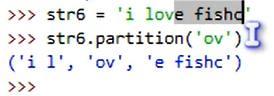
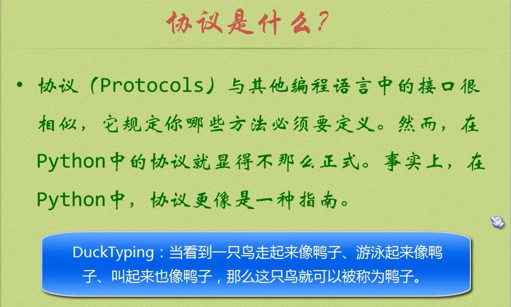
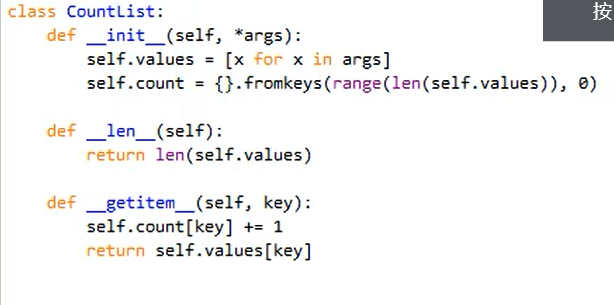

## python的数据类型

### 类型判断

``` python
isinstance(a, str) # 判断a是不是str类型

type（a） # 返回a的类型

```

## 算数操作符

```python
# 整除，浮点数也支持
//
# 正常的除法
/
# 求余数
%
```

## 分支和循环语句

### 条件表达式

```python
small = x if x < y else y
```

### 断言

```python
assert 3 > 4 # 触发断言，抛出AssertionError异常
```

## 列表

列表可以存放几种不同类型的数据，还可以套娃（列表中放列表）。

```python
# extend方法
参数是一个列表，在当前列表末尾添加列表
# insert方法
要传入插入的位置
# remove方法
传入成员内容，如果没有会抛出ValueError异常
# del语句
del a[0]
# pop方法
弹出最后一个元素，并返回
还可以传入要弹出的index弹出对应的元素
# count方法
返回某个元素的个数
# index方法
返回某个元素的index，可以加范围
# reverse方法
翻转
# sort方法
reverse参数，排序方法
```

列表分片

```python
# 左闭右开
```

列表操作符

```python
# +号
列表拼接
# * 号
复制
# in 和 not in

```

list需要注意的地方

```python
list7 = list6 # 同一个
list8 = list[:] # 拷贝

```


## 元组

确定了之后就不能修改，但是可以访问

需要注意的点

```python
temp = (1) # 是一个整型
temp = 2, 3, 4 # 是一个元组
temp=(1,) # 也是一个元组
所以关键是要有逗号
```

元组的更新和删除

```python
temp = (1,"c", 39,10)
temp = temp[:2] + ("wshaow",) + temp[2:] # 中间加上了一个元组，其实是新建了一个元组
```

## 字符串

```python
# join方法
传入一个字符串，将传入的字符串进行隔开
# ljust 左对齐
# lstrip
删除字符串前面的空格
# rstrip
删除字符串末尾的空格
# partition（sub）
# replace替换
#split函数，会删除分割的字符串
# strip去除前后的指定的元素

```




格式化


## 序列

迭代器

zip 之类的函数

## 函数

参数传递问题

```python
def test(a):
    a[0] = 10
```

若传入一个列表，会改变传入的列表的值。传入元组会报错，元组不可以修改

### 内嵌函数

```python
def func1():
    frint("func1")
    def func2():
        print("func2")
    func2()
```

这里可以func2函数不被外部调用

### 闭包

```python
def funcX(x):
    def funcY(y):
        return x*y
    return funcY

def funcX():
    x = 5
    def funcY():
        return x *= x
    return funcY

# 直接调用funcX()要报错,x为赋值就使用了
def funcX():
    x = 5
    def funcY():
        return x *= x
    return funcY()

def funcX():
    x = 5
    def funcY():
        nonlocal x # 使用上一级变量空间
        return x *= x
    return funcY()

# 这里由于使用了列表就可以，原因是列表不在栈中
def funcX():
    x = [5]
    def funcY():
        return x[0] *= x[0]
    return funcY()

        
```

### 装饰器


### lambda表达式

```python
lambda x: x*2
```

### filter(lambda, list)

map(lambda, list)

## 递归

python设置递归的层数

```python
import sys
sys.setrecursionlimit(1000)
```

## 字典


访问字典的方法

```python
keys()通常用在for中
values()
items（）
# get方法
如果不成功会返回None
```


赋值与浅拷贝


## 集合


## 文件

os模块

os.path模块

pickle模块 永久保存变量

## 异常处理

python标准异常总结


有下面类型的语句

```python
while:
    if:
        break
else:
    # break后执行

try:
    
except:
    
else:
    #没有except的情况执行
    
```


## 类和对象

类名约定大写字母开头

```python
python将__name的成员变量名，自动改成了_类名__变量名
```

### 继承


初始化父类成员变量


尽量慎用多继承

属性和方法相同会把方法覆盖掉。这部分可以看下小甲鱼的拾遗部分。

### 实例属性和类属性

### 一些相关的BIF

```python
issubclass(B,A) #判断一个类是否是一个类的子类
isinstance（对象，类）#判断对象是否是某个类的实例
hasattr(对象，属性名)#判断某个对象是否有某个属性名
getattr(对象，属性名，如果没有返回的默认值)
setattr(对象，属性名，设置的值)
property(获取，设置，删除属性函数)
```


### 构造和析构

对象实例化最先调用`__new__`方法，并不是最先调用init方法

垃圾回收机制会调用`__del__`方法

### 属性访问


下面的写法会进入死循环，循环进行属性设置


解决方法一：调用基类的方法


### 描述符


理解property函数


### 定制序列






### 迭代器


### 生成器


## 模块

```python
if __name__ == "__main__":的作用
    
```

搜索路径：

```python
import sys
sys.path#存放了搜索路径
sys.path.append(要添加的搜索路径)

```

