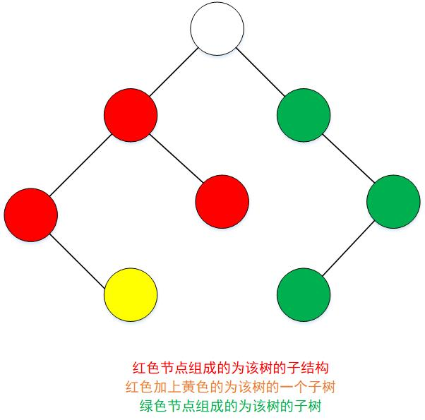
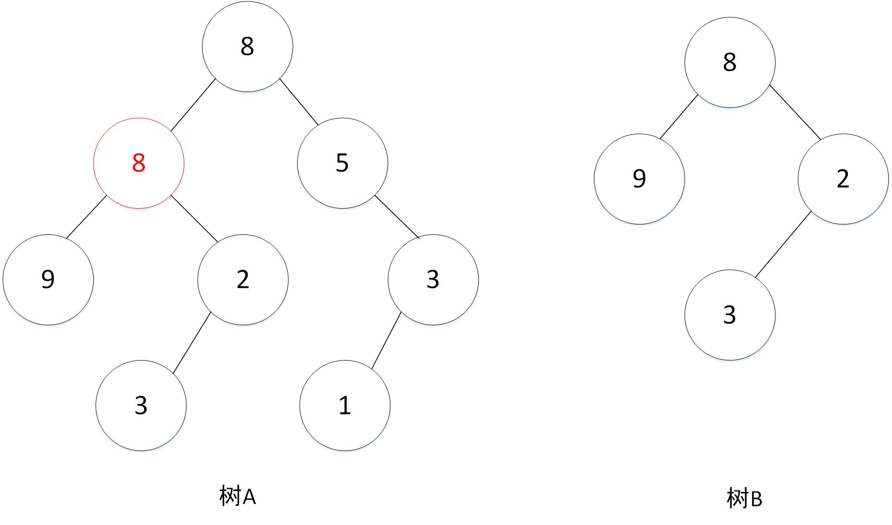

## 树的子结构
今天的题目是一题和二叉树相关的算法题，这里需要了解二叉树的遍历和什么是数的子结构。

### 1、题目描述
输入两棵二叉树A，B，判断B是不是A的子结构。（ps：我们约定空树不是任意一个树的子结构）

### 2、题目解析

#### 2.1 什么是树的子结构

这里主要是要区分树的子结构和子树：

**树的子结构** 如果一个二叉树B是二叉树A的子结构，那么这要B这个结构在A中出现就可以。

**数的子树** 如果一个二叉树B是二叉树A的子树，那么二叉树B必是A的某个节点的左子树或者右子树或者就是二叉树A本身。

可以看出子树是要比子结构更加严格的，如果B是A的子树那必定是A的子结构，反之则不然。

下面有一个图说明二者的区别。


#### 2.2 解题思路
**step1**：遍历二叉树A，找到对应的与二叉树B根节点值相等的节点，如果找到了进入**step2**。
**step2**: 假如**step1** 找到了一个节点Node， 以Node为根节点的二叉树的子树，依次从这个子树的根节点和二叉树B的根节点开始遍历依次比较每个对应的节点是否相等。



具体的实现看代码：

``` C++
/*
struct TreeNode {
	int val;
	struct TreeNode *left;
	struct TreeNode *right;
	TreeNode(int x) :
			val(x), left(NULL), right(NULL) {
	}
};*/
class Solution {
public:
    bool HasSubtree(TreeNode* pRoot1, TreeNode* pRoot2)
    {
        if(pRoot2 == NULL) return false;
        
        // step1 :使用先序遍历遍历二叉树A
        stack<TreeNode*> helpStack;
        if (pRoot1) helpStack.push(pRoot1);
        while(!helpStack.empty()){
            pRoot1 = helpStack.top(); helpStack.pop();
            if(pRoot1->val = pRoot2->val){//step2 : 匹配上了
                if(isMatch(pRoot1, pRoot2)) return true;
            }
            if(pRoot1->right) helpStack.push(pRoot1->right);
            if(pRoot1->left) helpStack.push(pRoot1->left);
        }
        return false;
        
    }
    
    bool isMatch(TreeNode* root1, TreeNode* root2){
        
        if(root2 == NULL) return true;
        if(root1 == NULL && root2 != NULL) return false;
        
        if(root1->val != root2->val) return false;

        return isMatch(root1->left, root2->left) && isMatch(root1->right, root2->right);
    }
    
};

```


