## <center>如何清理C盘：windows深度清理</center>

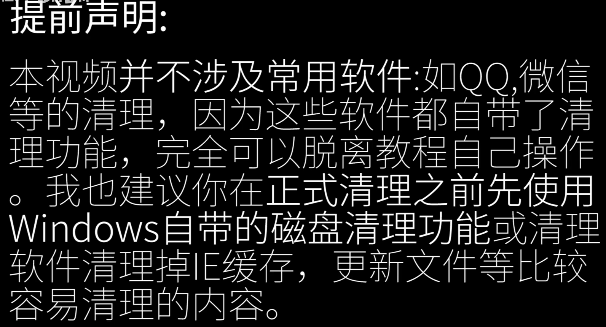

[TOC]


### 第一步：休眠

关闭Windows的休眠功能

管理员身份打开cmd，输入命令

```shell
powercfg -h off
```

### 第二步转移系统默认库文件夹

1、选择要更改的库，选择属性

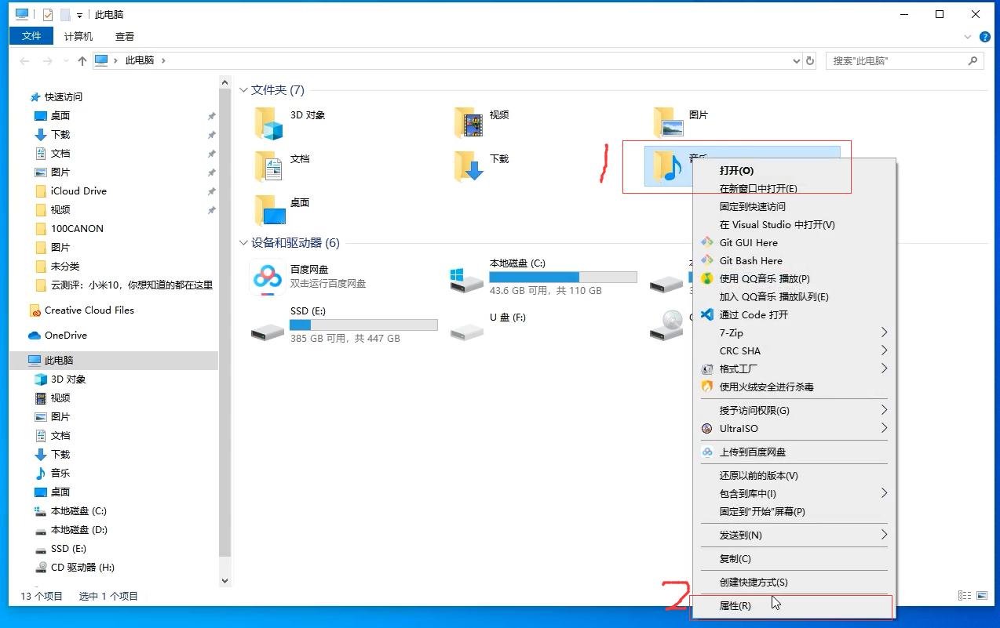

2、移动到自己想移动到的位置

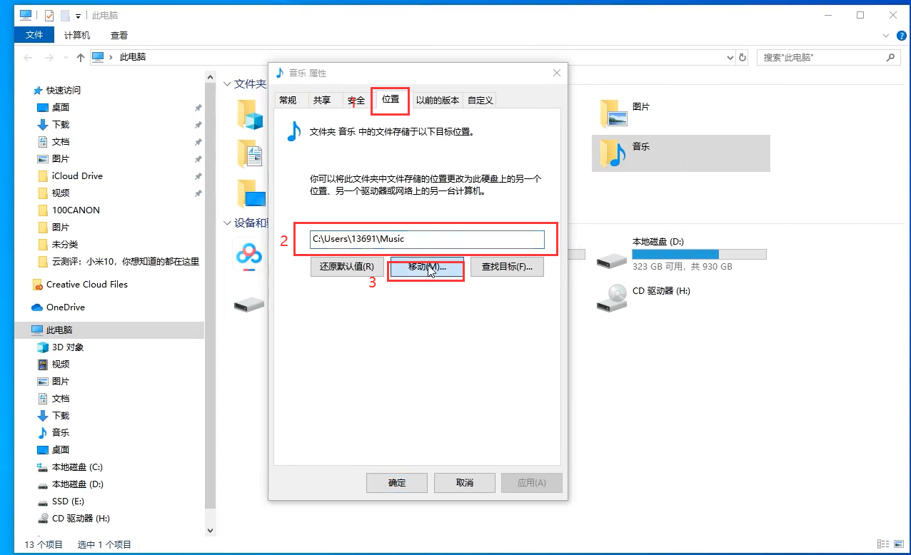

### 第三步：将系统的虚拟内存转移到别的分区

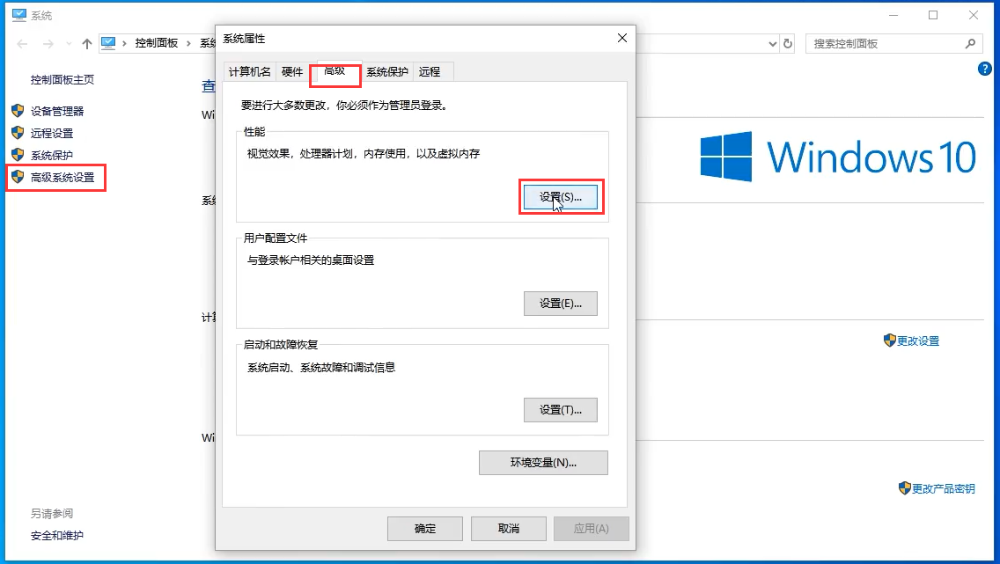

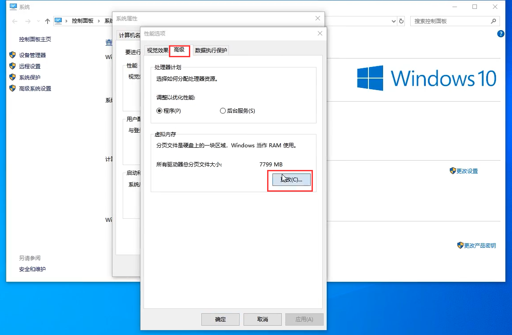

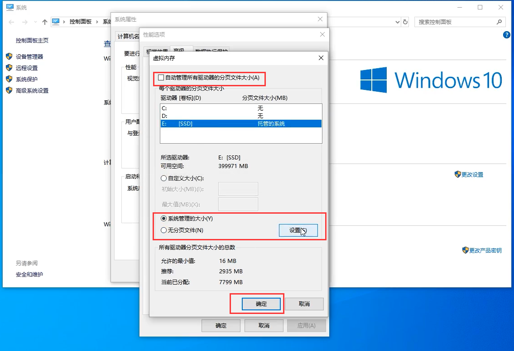

### 第四步：清理并转移系统的缓存文件

先在另外的盘中新建两个文件名为全英文的文件夹G:\systemTemp\User， G:\systemTemp\Windows

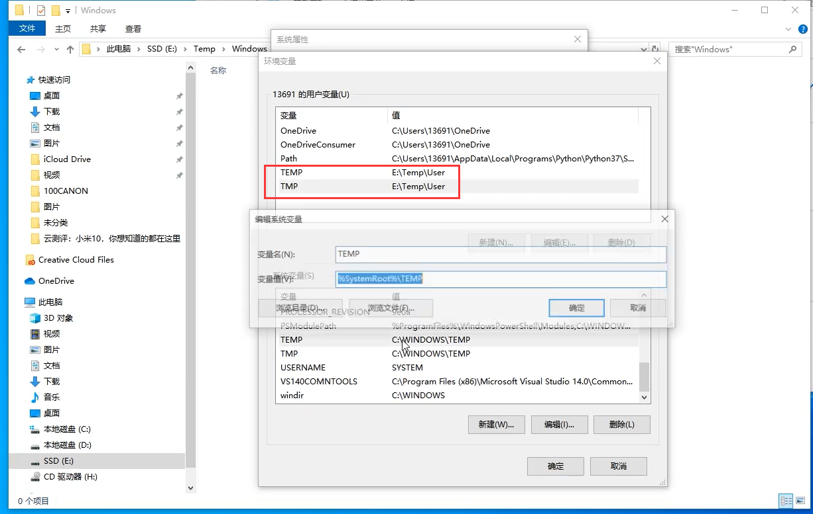

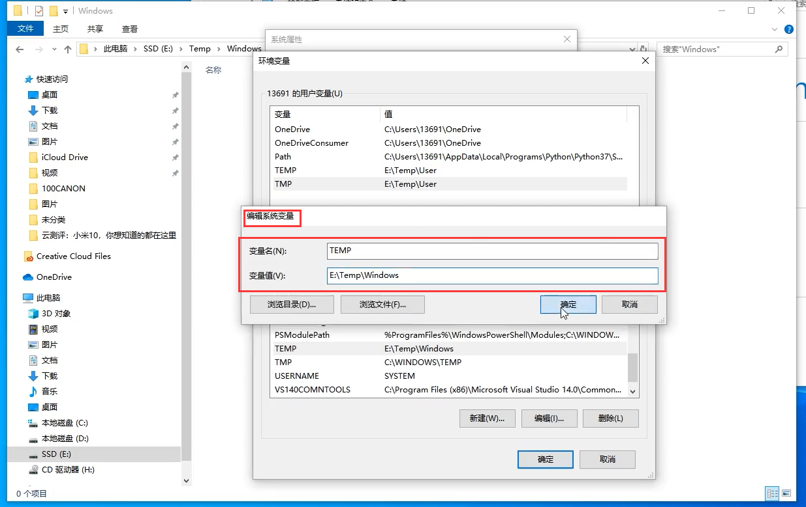

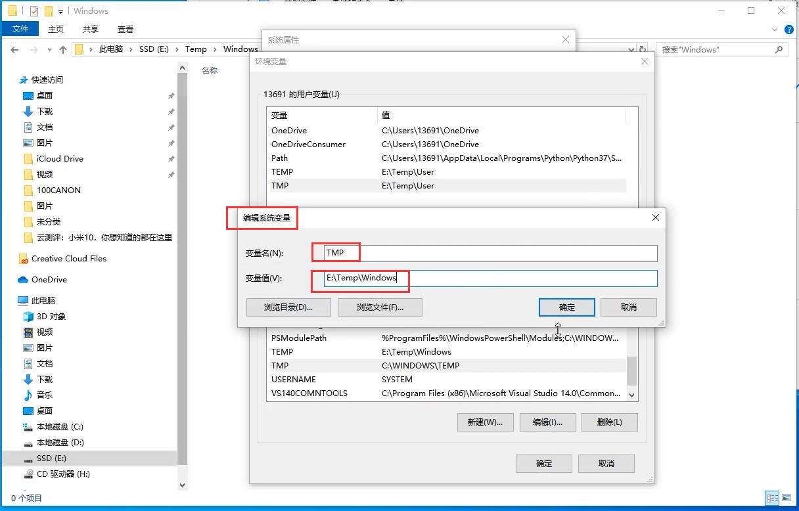

删除原来的temp中的文件

C:\用户/用户名/Appdata/Local/Temp

C:\Windows\Temp

### 第五步：清理独立显卡驱动安装程序所产生的无用文件

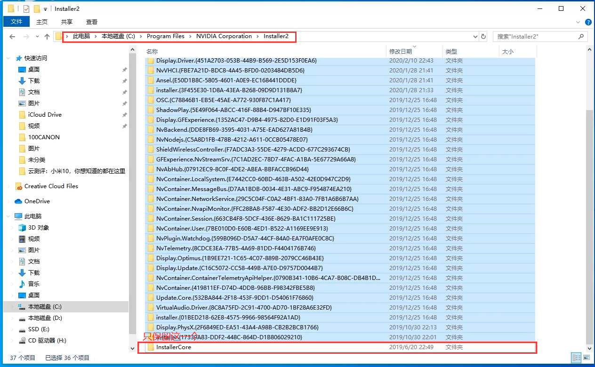

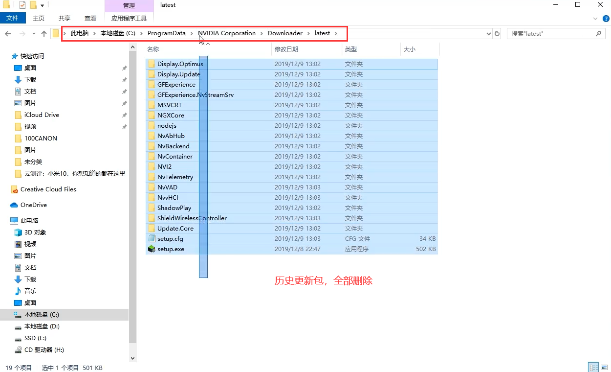

### 第六步：清理windows为老驱动所做的备份文件

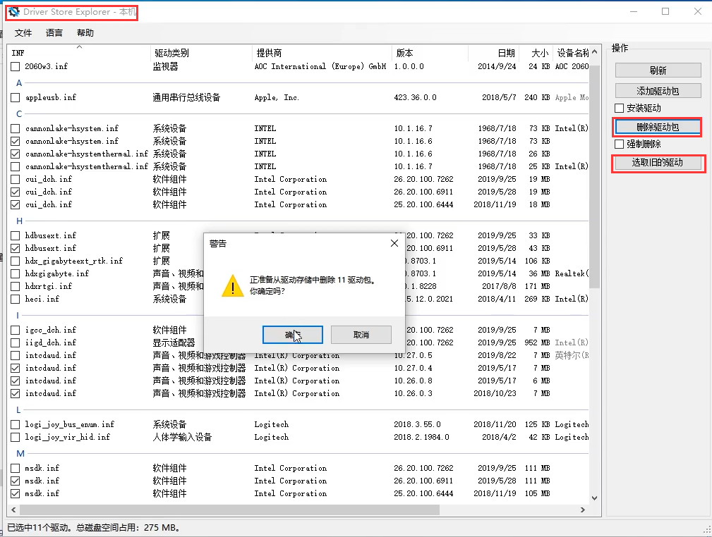

### 补充

Windows日志目录：C:\Windows\System32\winevt\Logs Windows更新临时文件：C:\Windows\SoftwareDistribution\Download 系统升级补丁备份：C:\Windows\WinSxS\Backup 可以按需删除 休眠请酌情关闭 缓存文件最好放在SSD

Driver Store Explorer原版地址：https://github.com/lostindark/DriverStoreExplorer
评论区热心观众传的百度盘：https://pan.baidu.com/s/1xfdP1_uM5EBvy3FpRpil4w 提取码: n8xq
蓝奏盘：https://www.lanzous.com/i9jc1ta

说一下操作可能产生的后果：
关闭休眠：快速启动和休眠功能无法使用（最直观的感受就是开机小幅变慢）
转移库文件：误转移到某个分区根目录下会导致无法更改回去
缓存文件：放在机械硬盘会导致系统变慢
虚拟内存：同上
清理老版本驱动：驱动出现错误时无法回滚
清理N卡驱动：没法单项卸载

请自行思考利弊后酌情操作
清理垃圾是不得已而为之，而不是闲着没事就清一下 最好的办法还是换大硬盘